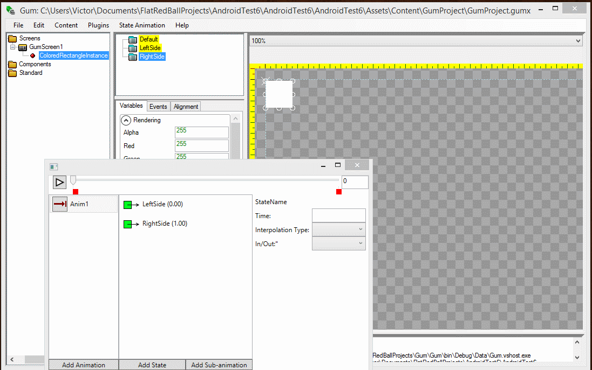

# Introduction to Animation

## Introduction

Gum supports creating and previewing animations in the editor through the use of states. The general workflow for creating an animation is as follows:

1. Create states representing the keyframes in the animation \(usually one category per animation\)
2. Add an animation to the component or screen
3. Add states to the animation and adjust their time
4. Set interpolation values for each keyframe to control "easing"

## Examples of animations

Gum's animation system is very powerful and can be used in a variety of situations:

* Animations which play when a screen or component is shown or hidden
* Animations used to transition between behavior states such as changing a button from regular to highlighted state
* Lengthy animations which can last multiple seconds for complex transitions

## Storage of animations

Animations are stored separate from the screen or component on the file system. If a screen or component contains at least one animation then Gum will save a Gum Animation XML file \(.ganx extension\) with the word "Animations" appended on the screen or component's name. In other words GameScreen would have a file called GameScreenAnimations.ganx in the same folder containing information about its animations.

## Playing animations

Once an animation has been made it can be played back in editor. The following shows how an animation is played back, both in real time and also by dragging the slider.

