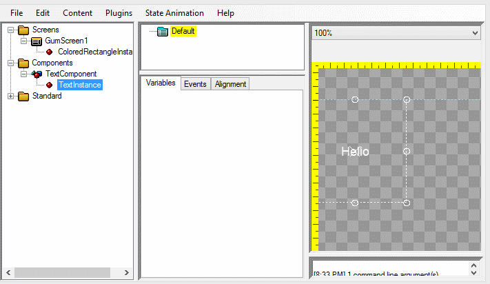
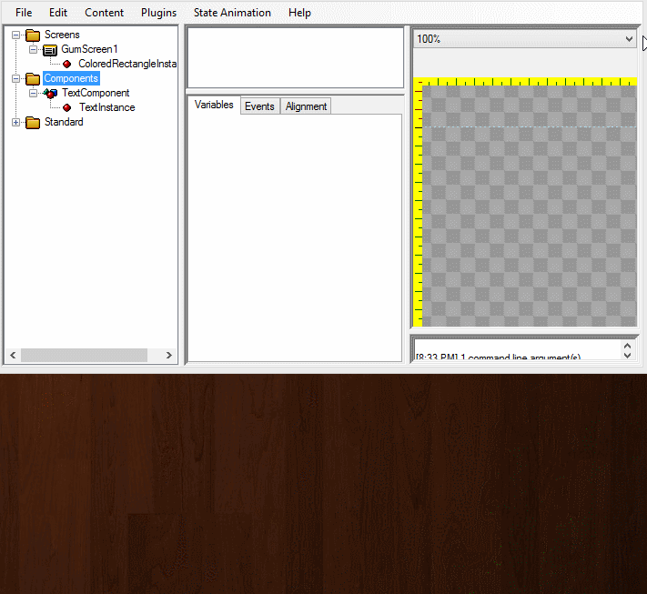
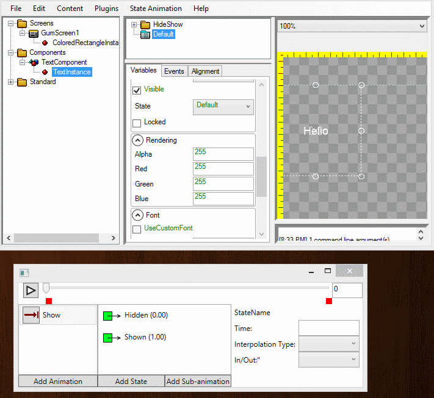

# Usage Guide\_ Creating an Animation

## Introduction

This article shows how to create an animated component. It will contain an animation which can be used when the component first appears.

## Creating the Component

First we'll create a component which will be animated. To do this:

1. Right-click on Components
2. Select "Add Component"
3. Enter the name "TextComponent" and click OK
4. Drag+drop the "Text" Standard into the TextComponent to create a Text instance
5. Select the "Alignment" tab and click the middle button to have the TextInstance fill the TextComponent
6. Select the Variables tab and change the VerticalAlignment and HorizontalAlignment to Center

## Creating the States

Now that we have a component we'll add the states needed for animation. We'll add all states in a category called HideShow. To create the states:

1. Right click on the States section
2. Select "Add Category"
3. Enter the name "HideShow"
4. Right-click on the HideShow folder
5. Select "Add State"
6. Enter the name "Hidden" and click OK
7. Right-click on the HideShow folder
8. Select "Add State"
9. Select "Shown"

## Setting values in the states

Now that we have the states defined we can set values for the states. In this case the only thing we'll be modifying is the TextInstance's "Font Scale" value. To do this:

1. Select TextInstance
2. Select the "Hidden" state
3. Set the Font Scale to 0.  This makes the Text so small that it's invisible
4. Select the "Shown" state
5. Set the Font Scale to 1.  This effectively makes the Text regular size

## Creating the Show animation

The two states we created above will be used as the keyframes for our animation. The animation will begin in the Hidden state then interpolate to the Shown state. To add this animation:

1. Verify that TextComponent or any objects under it are selected
2. Select "State Animation" -&gt;"View Animations"
3. Click the "Add Animation" button
4. Name the animation "Show" and click OK
5. Select the Show animation and click "Add State"
6. Select the Hidden state and click OK - this is the first keyframe in our animation
7. Click "Add State" again
8. Select "Shown" and click OK

The animation can now be played or previewed:

## Adjusting Interpolation Type

The "Interpolation Type" value sets how one keyframe blends to another. By default keyframes use "Linear" interpolation. When interpolating from one keyframe to another, the first one defines the interpolation type. In our case the "Hidden" frame defines the interpolation type. We can change this and preview the animation:

1. Select the "Hidden" keyframe
2. Change "Interpolation Type:" to "Elastic"

Playing the animation will reflect these changes.

