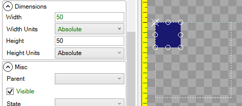
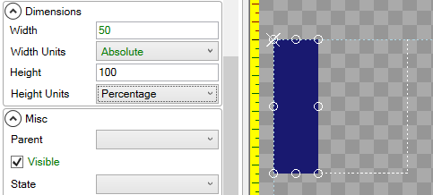
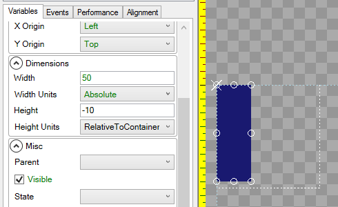
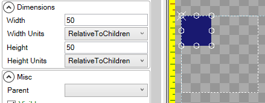
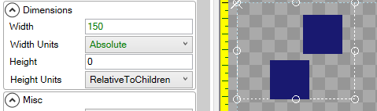
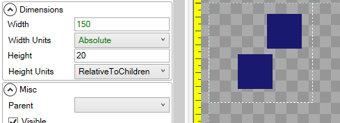
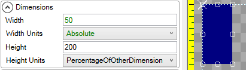
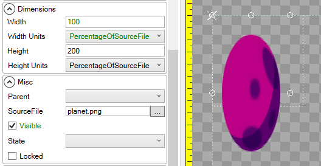

# Height Units

## Introduction

The **Height Units** variable controls how a unit is vertically sized, which may be relative to its parent. By default an object uses **Absolute** height, where each unit represents 1 pixel of height in pixels. When using **Absolute**, an object ignores its parents' With.

## Absolute

The following shows a child [ColoredRectangle](https://github.com/KallDrexx/gum-docs-temp/tree/34f8cf390aa0e8acda804733eaad97a22b8c533b/Gum/coloredrectangle/ColoredRectangle.html) with 50 **Absolute** Height:

## Percentage

The following shows a child [ColoredRectangle](https://github.com/KallDrexx/gum-docs-temp/tree/34f8cf390aa0e8acda804733eaad97a22b8c533b/Gum/coloredrectangle/ColoredRectangle.html) with 100 **Percentage** Height, which means it will have 100% of the height of its parent. Note that 100 **Percentage** is the same as 0 **RelativeToContainer**:

If an object uses **Percentage** Height, but has no parent, it will size itself as a percentage of the entire screen's height.

## RelativeToContainer

The following shows a child [ColoredRectangle](https://github.com/KallDrexx/gum-docs-temp/tree/34f8cf390aa0e8acda804733eaad97a22b8c533b/Gum/coloredrectangle/ColoredRectangle.html) with -10 **RelativeToContainer** Height, which means it will always be 10 pixels less tall than its parent.

If an object uses **RelativeToContainer** Height, but has no parent, it will size itself relative to the entire screen's height.

## RelativeToChildren

The following image shows a child [ColoredRectangle](https://github.com/KallDrexx/gum-docs-temp/tree/34f8cf390aa0e8acda804733eaad97a22b8c533b/Gum/coloredrectangle/ColoredRectangle.html) with 50 **RelativeToChildren** Height, which means that it will always be 50 pixels taller than is necessary to contain its children. Since the rectangle has no children, this is the same as having 50 **Absolute** Height:

**RelativeToChildren** can be used to size an object based on the position and sizes of a container's children. The following image shows a container with 0 **RelativeToChildren** Height, which mans that its height is set just large enough to contain its children.

A non-zero **Height** when using **RelativeToChildren** can be used to add additional padding to a parent container. The following image shows a container with 20 pixels of padding height:

For more information on relative layout in regards to absolute vs. relative unit types, see the [Relative Layout Unit Type](https://github.com/KallDrexx/gum-docs-temp/tree/34f8cf390aa0e8acda804733eaad97a22b8c533b/pages/gum%20elements/general%20properties/Relative%20Layout%20Unit%20Type/README.md) page.

## PercentageOfOtherDimension

**PercentageOfOtherDimension** will adjust the object's effective height so it remains proportional to the Width value multiplied by the Height value \(as a percentage\). For example, if a Height value of 200 is entered, then the effective height will be 200% \(2x\) of the width.

The following image shows a child [ColoredRectangle](https://github.com/KallDrexx/gum-docs-temp/tree/34f8cf390aa0e8acda804733eaad97a22b8c533b/Gum/coloredrectangle/ColoredRectangle.html) with a Height of 200 **PercentageOfOtherDimension**. In this image, the **Width** value is 50 units, so the effective height is 100 units:

## PercentageOfSourceFile

The [Sprite](https://github.com/KallDrexx/gum-docs-temp/tree/34f8cf390aa0e8acda804733eaad97a22b8c533b/pages/gum%20elements/general%20properties/Sprite/README.md) type has an extra **Height Unit** called **PercentageOfSourceFile**, which will set the height of the Sprite according to the file that it is displaying. This is the default **Height Unit** for Sprites.

The following image shows a child [Sprite](https://github.com/KallDrexx/gum-docs-temp/tree/34f8cf390aa0e8acda804733eaad97a22b8c533b/pages/gum%20elements/general%20properties/Sprite/README.md) with 200 **PercentageOfSourceFile** Height, which means it will draw two times as tall as its source image:

