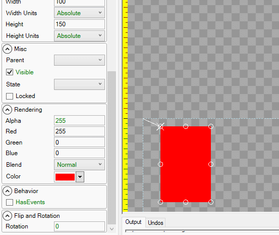
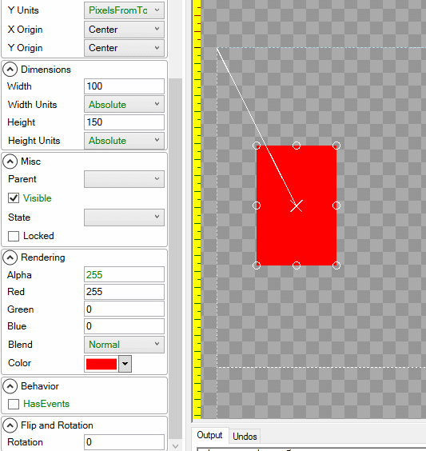

# Rotation

## Introduction

The Rotation property can be used to rotate Gum components. It is measured in degrees, where positive values rotate an object counterclockwise about its origin \([X Origin](https://github.com/KallDrexx/gum-docs-temp/tree/34f8cf390aa0e8acda804733eaad97a22b8c533b/pages/gum%20elements/general%20properties/X%20Origin/README.md) and [Y Origin](https://github.com/KallDrexx/gum-docs-temp/tree/34f8cf390aa0e8acda804733eaad97a22b8c533b/pages/gum%20elements/general%20properties/Y%20Origin/README.md)\).

## Example

An object is rotated by its origin, which by default is its top-left corner:

## X Origin and Y Origin

The [X Origin](https://github.com/KallDrexx/gum-docs-temp/tree/34f8cf390aa0e8acda804733eaad97a22b8c533b/pages/gum%20elements/general%20properties/X%20Origin/README.md) and [Y Origin](https://github.com/KallDrexx/gum-docs-temp/tree/34f8cf390aa0e8acda804733eaad97a22b8c533b/pages/gum%20elements/general%20properties/Y%20Origin/README.md) properties define the point of rotation for an object. For example, the following shows a rectangle rotated about its center:

