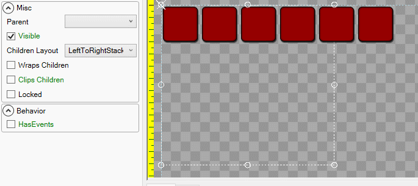

# Introduction

The _Wraps Children_ property controls whether children wrap or stack beyond their container's boundaries when the container's [Children Layout](https://github.com/KallDrexx/gum-docs-temp/tree/34f8cf390aa0e8acda804733eaad97a22b8c533b/pages/gum%20elements/general%20properties/Children%20Layout/README.md) is set to _LeftToRight_ or _TopToBottom_.

