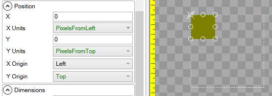
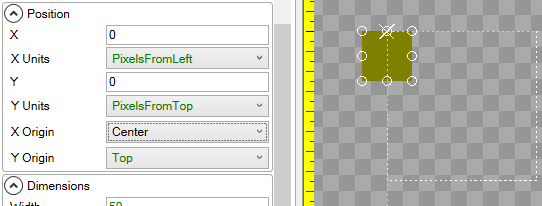
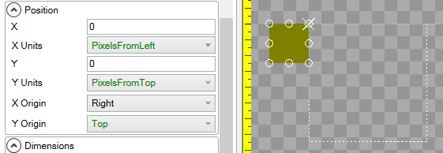

# X Origin

## Introduction

The **X Origin** variable controls the point which an object is positioned by. By default the **X Origin** is **Left**. The **X Origin** is shown visually as a white "X" in the editor.

## Left

The following image shows a [ColoredRectangle](https://github.com/KallDrexx/gum-docs-temp/tree/34f8cf390aa0e8acda804733eaad97a22b8c533b/pages/gum%20elements/general%20properties/ColoredRectangle/README.md) with its **X Origin** set to **Left**:

## Center

The following image shows a [ColoredRectangle](https://github.com/KallDrexx/gum-docs-temp/tree/34f8cf390aa0e8acda804733eaad97a22b8c533b/pages/gum%20elements/general%20properties/ColoredRectangle/README.md) with its **X Origin** set to **Center**:

## Right

The following image shows a [ColoredRectangle](https://github.com/KallDrexx/gum-docs-temp/tree/34f8cf390aa0e8acda804733eaad97a22b8c533b/pages/gum%20elements/general%20properties/ColoredRectangle/README.md) with its **X Origin** set to **Right**:

