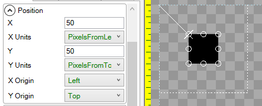
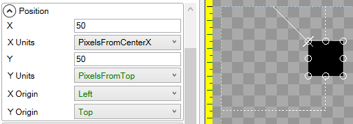
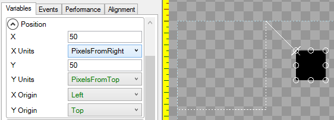
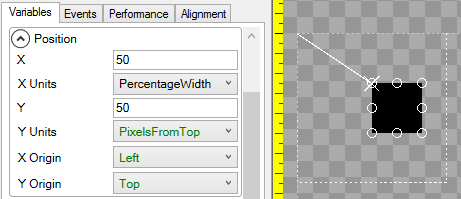

# Introduction

The **X Units** variable controls how a unit is horizontally positioned relative to its parent. By default an object is positioned relative to the left of its parent, where each unit represents 1 pixel.

## PixelsFromLeft

The following shows a child [ColoredRectangle](https://github.com/KallDrexx/gum-docs-temp/tree/34f8cf390aa0e8acda804733eaad97a22b8c533b/pages/gum%20elements/general%20properties/ColoredRectangle/README.md) positioned 50 **PixelsFromLeft** relative to its parent:

## PixelsFromCenterX

The following shows a child [ColoredRectangle](https://github.com/KallDrexx/gum-docs-temp/tree/34f8cf390aa0e8acda804733eaad97a22b8c533b/pages/gum%20elements/general%20properties/ColoredRectangle/README.md) positioned 50 **PixelsFromCenterX** relative to its parent:

## PixelsFromRight

The following shows a child [ColoredRectangle](https://github.com/KallDrexx/gum-docs-temp/tree/34f8cf390aa0e8acda804733eaad97a22b8c533b/pages/gum%20elements/general%20properties/ColoredRectangle/README.md) positioned 50 **PixelsFromRight** relative to its Parent:

## PercentageWidth

The following shows a child [ColoredRectangle](https://github.com/KallDrexx/gum-docs-temp/tree/34f8cf390aa0e8acda804733eaad97a22b8c533b/pages/gum%20elements/general%20properties/ColoredRectangle/README.md) positioned 50 **PercentageWidth** relative to its Parent. In other words, it will be positioned halfway between the left and right edges of the Parent:

