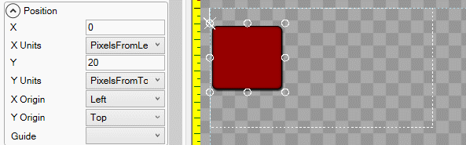

# X

## Introduction

The X property controls the horizontal position for an object. The X value represents the position of an object's [X Origin](https://github.com/KallDrexx/gum-docs-temp/tree/34f8cf390aa0e8acda804733eaad97a22b8c533b/pages/gum%20elements/general%20properties/X%20Origin/README.md), using its [X Units](https://github.com/KallDrexx/gum-docs-temp/tree/34f8cf390aa0e8acda804733eaad97a22b8c533b/pages/gum%20elements/general%20properties/X%20Units/README.md).

## Example

By default, an object's top-left corner is positioned relative to its parent's top-left corner.

