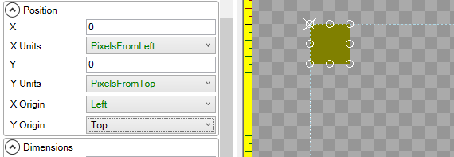
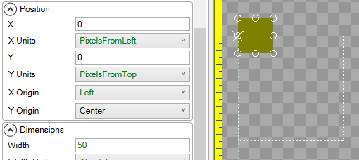
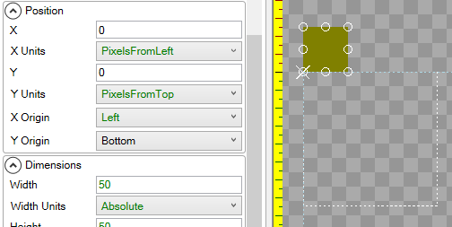

# Y Origin

## Introduction

The **Y Origin** variable controls the point which an object is positioned by. By default the **Y Origin** is **Top**. The **Y Origin** is shown visually as a white "X" in the editor.

## Top

The following image shows a [ColoredRectangle](https://github.com/KallDrexx/gum-docs-temp/tree/34f8cf390aa0e8acda804733eaad97a22b8c533b/pages/gum%20elements/general%20properties/ColoredRectangle/README.md) with its **Y Origin** set to **Top**:

## Center

The following image shows a [ColoredRectangle](https://github.com/KallDrexx/gum-docs-temp/tree/34f8cf390aa0e8acda804733eaad97a22b8c533b/pages/gum%20elements/general%20properties/ColoredRectangle/README.md) with its **Y Origin** set to **Center**:

## Bottom

The following image shows a [ColoredRectangle](https://github.com/KallDrexx/gum-docs-temp/tree/34f8cf390aa0e8acda804733eaad97a22b8c533b/pages/gum%20elements/general%20properties/ColoredRectangle/README.md) with its **Y Origin** set to **Bottom**:

