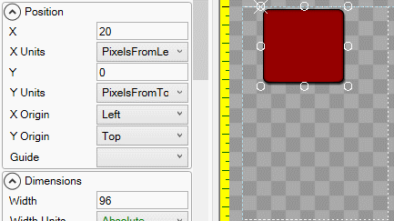

# Y

## Introduction

The Y property controls the vertical position for an object. The Y value represents the position of an object's [Y Origin](https://github.com/KallDrexx/gum-docs-temp/tree/34f8cf390aa0e8acda804733eaad97a22b8c533b/pages/gum%20elements/general%20properties/Y%20Origin/README.md), using its [Y Units](https://github.com/KallDrexx/gum-docs-temp/tree/34f8cf390aa0e8acda804733eaad97a22b8c533b/pages/gum%20elements/general%20properties/Y%20Units/README.md).

## Example

By default, an object's top-left corner is positioned relative to its parent's top-left corner.

