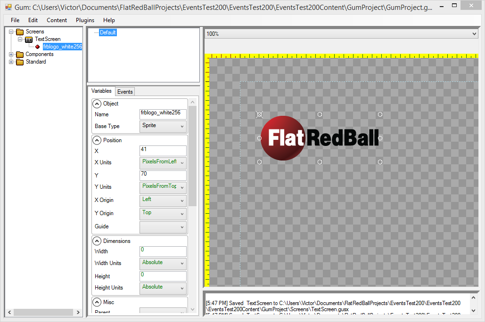

# Sprite

## Introduction

Sprites are objects which can draw an image \(such as a .png\) or a portion of a .png.

## Sprite Properties

* [Sprite.Color](https://github.com/KallDrexx/gum-docs-temp/tree/34f8cf390aa0e8acda804733eaad97a22b8c533b/pages/gum%20elements/sprite/Sprite.Color)
* [Sprite.Texture Address](https://github.com/KallDrexx/gum-docs-temp/tree/34f8cf390aa0e8acda804733eaad97a22b8c533b/pages/gum%20elements/sprite/Sprite.Texture%20Address)

