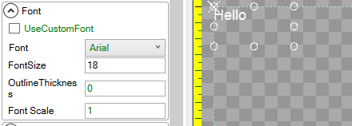

# Introduction

Font Size controls how large a font appears on screen. Each font size and Font combination creates its own rasterized font, so using a lot of different font sizes will increase the amount of texture memory your game needs.

# Example

The Font Size property can be set in Gum to make a text object's font larger or smaller. For example, the following shows a Text object with a font size of 18:

Changing the font size will increase the size of the Text object. For example, here is the same Text object with a Font Size of 36:

# Font Cache

The first time a Font and Font Size combination are referenced, Gum creates a file in the FontCache folder. You may notice a small pause in Gum when setting Font and Font Size combinations for the first time as the file is created, but subsequent changes will be fast.

The FontCache folder is located in the following location:

<Gum Project>/FontCache/

