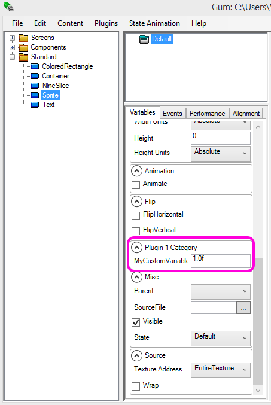

# PluginBase.AddAndRemoveVariablesForType

## Introduction

The AddAndRemoveVariablesForType event allows plugins to add and remove variables from standard elements. Since Gum is designed to work with external engines the properties presented by standard types \(such as Sprite\) may not align with the feature set of the external engine. Variables can be added and removed to create a more natural development experience for users of Gum.

## Code Example

The following code can be used to add a variable to the Sprite standard element. This variable will be a float variable with the name "MyCustomVariable".

First the event must be added in the StartUp method:

```text
  public override void StartUp()
  {
      this.AddAndRemoveVariablesForType += HandleAddAndRemoveVariablesForType;
  }
```

The HandleAddAndRemoveVariablesForType method handles the event being raised and adds the necessary variables. Note that in this case we are only handling variables for the Sprite type, but the same method could be used for all types:

```text
private void HandleAddAndRemoveVariablesForType(string type, Gum.DataTypes.Variables.StateSave stateSave)
{
    if (type == "Sprite")
    {
        // Add startup logic here:
        var variableToAdd = new Gum.DataTypes.Variables.VariableSave();
        variableToAdd.Name = "MyCustomVariable";
        variableToAdd.Type = "float";
        variableToAdd.Value = 1.0f;
        variableToAdd.IsFile = false;
        variableToAdd.Category = "Plugin 1 Category";
        // We must mark this as true if we want the default value to be used:
        variableToAdd.SetsValue = true;

        stateSave.Variables.Add(variableToAdd);
    }
}
```

The end result would be that the Sprite object displays the variable when selected:



## Variable removal

The example above shows how to add variables, but you can also remove variables from standard types. For example if your engine does not support texture wrapping on Sprites, you may do the following:

```text
private void HandleAddAndRemoveVariablesForType(string type, Gum.DataTypes.Variables.StateSave stateSave)
{
    if (type == "Sprite")
    {
        var variableToRemove = stateSave.Variables.FirstOrDefault(item => item.Name == "Wrap");

        stateSave.Variables.Remove(variableToRemove);
    }
}
```

To prevent accidental deletion of data, Gum will still present variables which are defined in the XML files for standard elements even if the variable is removed through a plugin. Therefore, to fully remove a variable \(like Wrap\), it must be removed from the underlying XML file as well. This can be done by removing the individual file from the XML file, or deleting the entire XML file \(which will cause Glue to regenerate it\). Keep in mind that deleting and regenerating the entire XML file will result in all other changes being lost.

## Additional Examples

The syntax used to add new variables in plugins is the same as how Gum adds standard properties. For an extensive example on how to add variables, see the StandardElementsManager.Initialize method.

